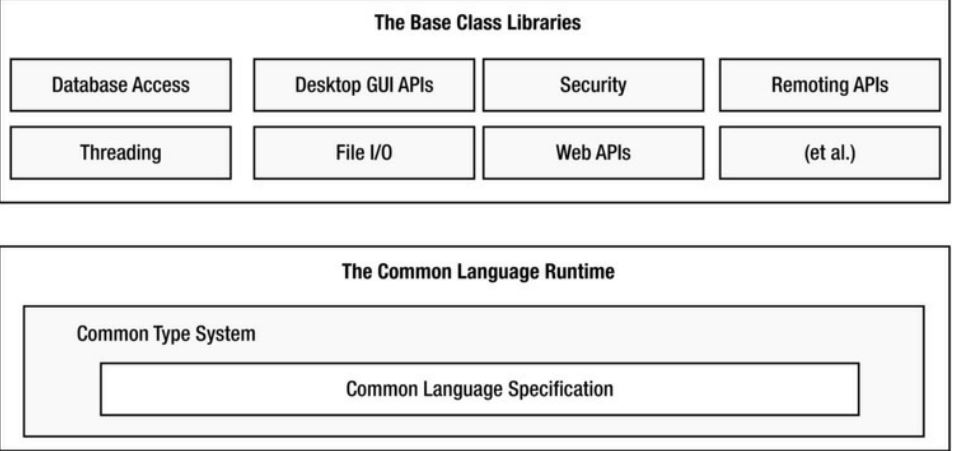

## ASP.NET MVC
## Chapter 1 .NET Framework
1. Introduction  
.Net Framework is a framework for building software systems. It provides run time environment(CLR) and comprehensive base class libraries(BCL).  

  ## 1.1 Key Features:
  *  **Multi language support**  
    Various languages(C++, C#, F#, VB) can be used to develop .NET applications
  * **Single Runtime Engine**  
  Various languages follow fixed standard and all run on single engine
  * **Comprehensive Base Class Libraries**  
  .Net Framework has predefined set of libraries through which you can build code libraries,  
    console(terminal) applications, graphical desktop applications, web applications etc.
  * **Simple Deployment**  
    Projects you develop using .NET framework can be deployed to any .NET running machine with ease.
  * **Interoperability with Existing Code**  
    .NET Framework  even can comingle with COM (Component Object Model) based softwares.
    ## Compilation of .NET Application
    Compilation of .NET program is two step process: 
    * **First Phase**:CLI generation from .NET Aware compilers
    * **Second Phase**: Machine Code from JIT Compiler
    
      

    Code Written in .NET aware Languages (C#, VB etc.) are compiled by .NET aware Compilers (C Sharp Compiler, Visual Basic Compiler etc.) and .Net Binary blob is created. .Net  binary blob is also termed as Assembly and it contains Common Immediate Language(CIL)* and Metadata. JIT** compilers compile CIL  codes to platform specific instructions. In this way compilation of .Net Code is done. 
    _*CIL is also termed as MicroSoft Intermediate Language(MSIL) or just Intermediate Language (IL)._
_**Just In Time (JIT) or Jitters compiles IL into Machine code on the fly_
## Common Lanaguage Specification(CLS)
CLS says how computer programs can be turned to CIL.
It is agreement among language designers and class library designers to use common subset of basic feature that all languages have to follow.
Multi Language Support is possible due to CLS.
## Common Type System (CTS)
Types are Classes, Delegates, Enumeration, Structures and Interfaces. CTS is formal specification that documents how types are declared, used and managed. CTS provides Object Oriented Model and it also provides a library  primitive data type.
It helps to enable cross language integration, type safety and high performance code execution.
## Common Language Runtime
It’s a collection of services that are required to execute a given compiled unit of code.
It is responsible for resolving location of assembly and finding the requested type within binary by reading contained metadata
It loads custom assemblies, creates custom types, interacts with types contained in .NET Base Class Libraries

