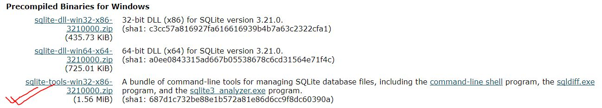
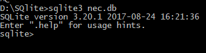

### Quick start guide to SQLite ###  
SQLite is open source, cross-platform self-contained, serverless, zero configuration sql database engine. 

#### Installation ####  
Go to [this link](https://sqlite.org/download.html) , and download sqlite-tools for your platform 

Unzip your downloaded file and move all files(sqldiff.exe, sqlite3.exe and sqlite3_analyzer.exe) to your appropriate location(For eg. I have moved all files in D:\SQlite)  
Now lets open command prompt on directory containing those files and type in
>>`D:\SQlite>sqlte3.exe`  
>>`SQLite version 3.20.1 2017-08-24 16:21:36`
`Enter ".help" for usage hints.`
`Connected to a transient in-memory database.`
`Use ".open FILENAME" to reopen on a persistent database.`
>> `sqlite>`  
Congratulations! you have successfully completed installation of Sqlite and got access to Command line tools.
1. **Creating Database**  
Before creating database, you have to understand what type of data does sqlite support. Sqlite supports following data types:  
* NULL
* Integer
* Real
* Text
* Blob  
With this infomration, lets create our first database "nec.db"
##### Creating Database #####  
Go to your directory in Console and type in 
>`D:\Sqlite> sqlite3 nec.db` 
you will see your ouput like in figure below:  

Congratulations !! you have created your database now.  you are in sqlite command line tools and you can perform CRUD functionalities.

1. **Creating Tables**  
Ok, lets create your first table student with columns: FullName, Roll, Age.
>>`CREATE TABLE Student(StudentID INT PRIMARY KEY NOT NULL, FullName TEXT NOT NULL, Roll TEXT NOT NULL, Age INT);`
1. **Inserting Data in Table(C)**
 Now, Lets insert some data:  
 >`INSERT INTO Student(StudentID, FullName, Roll, Age) Values(1, "Dhiroj Kumar Majhi", "NEC-014-412", 23);`  

 >`INSERT INTO Student(StudentID, FullName, Roll, Age) Values(1, "Sampurna Khanal", "NEC-014-435", 20);`  

 >`INSERT INTO Student(StudentID, FullName, Roll, Age) Values(1, "Dhiroj Kumar Majhi", "NEC-014-412", 23);`
1. **Reading Data(R)**  
 You can read your data using `SELECT` Statements:
 >`SELECT * FROM Student;`
 You can get particular columns only.
 >`SELECT FullName, Age FROM Student;`
You can impost conditions
> `SELECT * FROM Student WHERE Age>20;`
1. **Updating Data(U)**
> `UPDATE Student SET Age=26 WHERE StudentID=2;`
1. **Deleting Data(D)** 
> `DELETE FROM Student where StudentID=2;`

Congratulations guys !!! You have successfully completed quickstart hands on SQLite Database. Play with SQL to get fluent on 