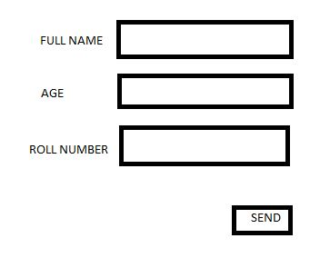

## 6 Data Annotations and Validation
Validation restricts user input to be of certain pattern. For example, if user needs to enter his/her age, he might put "Thirdy", instead of 30. Such a logic should be implemented not only in client-side but also from server side as well.

In MVC paradigm, validation pimarily focusses on validating model values. Did the user provide a required value? Is the value in the range? ASP.NET MVC validation features can help us in validating model values. A declarative style of validation using attributes in ASP.NET, is known as Data Annotation.

Data annotations are attributes found in System.ComponentModel.DataAnnotations namespace. Some of them are:
* Required :  
raises validation error if either property value is null or empty thus asserting user to enter the field value.
* StringLength  
sets maximum length for a given property. raises validation error if the value of the property exceeds its limit. You can also optionally specify minimum length using `MinimumLength` parameter.
* RegularExpression  
Properties like email needs to be in specific format. These can be validated using `RegularExpression` attribute.
* Range  
This attribute specifies minimum and maximum constraints for a numeric value.
* Compare  
This ensures two properties on a model have the same value. Example: email and confirm email should be same.

You can use `ErrorMessage` to localize your validation error messages.
Example:
consider we have Student Class :
```cs
public class Student
{
    public string FullName { get; set; }
    public int Age { get; set; }
    public string RollNumber { get; set; }
}
```
We have a form for this like:


With some data annotations, we can redefine the Student Class like this:
```cs
public class Student
{
    [Required(ErrorMessage="Please enter full name")]
    [StringLength(160), MinimumLength=3]
    public string FullName { get; set; }
    
    [Range(18, 60)]
    public int Age { get; set; }
    
    [Required]
    [StringLength(10)]
    public string RollNumber { get; set; }
}

```
In this way we can validate models using data annotations.
